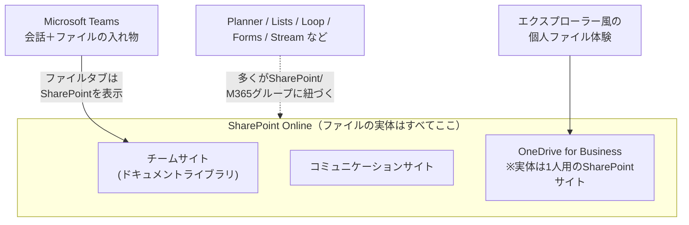

# 01. 全体アーキテクチャと棲み分け

[← 目次に戻る](./README.md) ｜ [← 00. はじめに](./00-introduction.md)

---

この章では、SharePoint Online・OneDrive・Teams・その他 M365 アプリが**どう連携し、それぞれ何を担うのか**、そして「**どこに何を置くか**」の原則を示します。フェーズ1で最初に全社合意を取るべき、最も重要な土台です。

## 1. まず理解する「ファイルの実体は SharePoint にある」

M365 のファイル系サービスは独立した別システムではなく、**SharePoint という共通の基盤**の上に成り立っています。

> 💡 **【補足】OneDrive も“SharePoint の一種”**
> 意外に思われますが、OneDrive for Business の実体は「**そのユーザー1人が所有者の SharePoint サイト**」です。だから SharePoint と OneDrive は操作感・バージョン履歴・共有の仕組みがほぼ同じです。違いは「**所有者が組織（チーム）か、個人か**」だけと捉えると整理しやすくなります。

この構造を理解すると、「Teams にアップしたファイルはどこにあるの？」という現場の疑問に、「**Teams の裏の SharePoint サイトのドキュメントライブラリにあります**」と一言で答えられます 〔S6〕〔S7〕。

## 2. 各サービスの役割分担

| サービス | 主な役割 | ひとことで言うと |
| --- | --- | --- |
| **OneDrive for Business** | 個人の作業ファイル・下書き・自分専用の一時ファイル。共有はしても“貸し出す”感覚 | **自分の引き出し** |
| **SharePoint（チームサイト）** | チーム・部門で共有し共同編集する正式なファイルの置き場 | **チームの書庫** |
| **SharePoint（コミュニケーション/ホームサイト）** | 全社・部門から広く“読ませたい”情報の発信（規程・ポータル・周知） 〔S3〕〔S4〕 | **社内Web・掲示板** |
| **Microsoft Teams** | 会話・会議を軸に、上記 SharePoint とアプリを1画面に束ねる作業ハブ | **チームの作業部屋** |
| **Planner / Lists / Loop / Forms / Stream 等** | タスク管理・簡易DB・共同メモ・アンケート・動画。多くが SharePoint / M365 グループに紐づく | **専用道具** |

> 💡 **【補足】M365 グループとは（何度も出てきます）**
> **Microsoft 365 グループ**は、「メンバーの集まり」に対して SharePoint サイト・Teams・予定表・Planner などをワンセットで結びつける“会員名簿＋共有設備一式”の仕組みです 〔S6〕〔S10〕。Teams でチームを作ると、この M365 グループと SharePoint サイトが**自動でセット生成**されます 〔S7〕。権限管理の中心になるので、[第03章](./03-information-architecture-and-permissions.md) で詳説します。

## 3. 「どこに何を置くか」棲み分けの原則（最重要）

移行前に、次の判断表を全社の共通ルールとして配布することを推奨します 〔S1〕。

| ファイル／情報の性質 | 置き場所 | 補足 |
| --- | --- | --- |
| 自分だけが使う下書き・一時ファイル・メモ | **OneDrive** | 完成したらチームの場所へ移す |
| 特定の相手に一時的に渡したい個人ファイル | **OneDrive**（共有リンク） | “自分所有のまま貸す”。退職時に消えるので長期共有には不向き |
| 部門・チームで日常的に共同編集する業務ファイル | **SharePoint チームサイト**（多くは Teams 経由） | 既定でメンバー全員がアクセス可 〔S1〕 |
| プロジェクト単位の作業ファイル | **プロジェクト用の Teams チーム／サイト** | 終了後はアーカイブ（フェーズ3で運用化） |
| 全社規程・申請書テンプレ・ポータル・お知らせ | **コミュニケーションサイト／ホームサイト** | 少数が編集、多数が閲覧 〔S3〕〔S4〕 |
| 部門内の一部だけで扱う機密ファイル | **プライベートチャネル**、または**専用サイト** | [第02章](./02-site-types-and-teams.md) の判断フロー参照 〔S8〕 |
| 社外パートナーと共同編集するファイル | **共有チャネル**、または外部共有を許可した専用サイト | 外部共有方針は本章§5・[第03章](./03-information-architecture-and-permissions.md) 〔S8〕〔S11〕 |

### アンチパターン（やりがちな失敗）

- **OneDrive を“チームの共有フォルダ”代わりに使う** → 所有者が退職・異動するとアクセス不能に。チーム資産は必ず SharePoint へ。
- **何でも巨大な1サイトに詰め込む** → 権限が複雑化。用途・アクセス範囲でサイトを分ける。
- **ファイルサーバーの深いフォルダ階層をそのまま移植** → モダンの利点（メタデータ・検索・フラット構造）を活かせない。[第03章](./03-information-architecture-and-permissions.md) 参照。

## 4. OneDrive の位置づけと「既知フォルダ移動（KFM）」

脱ファイルサーバーでは、各 PC の**デスクトップ／ドキュメント／ピクチャ**に散在する個人ファイルの受け皿として OneDrive を使います。**既知フォルダ移動（Known Folder Move, KFM）** を使うと、これらのフォルダの内容を自動で OneDrive に同期・バックアップでき、PC 故障・入替時もファイルを失いません 〔S2〕。

> 💡 **【補足】KFM（Known Folder Move）とは**
> Windows の「デスクトップ」「ドキュメント」「ピクチャ」を OneDrive 配下へ“引っ越し”させ、以後は自動でクラウド同期する仕組みです。ユーザーは今まで通りの保存先を使うだけで、実体がクラウドに保護されます。組織のポリシー（グループポリシー／Intune）で一括有効化するのが定石です 〔S2〕。

**注意**：KFM は「個人ファイルの保護」であり、「チーム共有ファイルの移行」ではありません。共有フォルダは SharePoint へ、個人フォルダは OneDrive へ、と経路を分けて計画します。

## 5. 外部共有の基本方針（フェーズ1での位置づけ）

フェーズ1では、外部共有を**「テナント全体の上限」と「サイトごとの設定」の二段構え**で設計する、という原則だけ押さえます 〔S11〕。

- 外部共有はテナント（組織）レベルとサイトレベルの両方で設定でき、**サイトの設定はテナントの上限を超えられません**。両者が異なる場合は**最も厳しい方**が適用されます 〔S11〕。
- 推奨の初期方針：テナント既定は「**新規/既存のゲスト（認証あり）まで許可**」に絞り、匿名の「リンクを知っている全員」は原則オフ。外部と共同作業する特定サイトだけ個別に緩める。
- 厳格な統制（ゲストのアクセスレビュー、機密サイトの外部共有ブロック、ドメイン許可リスト等）は**フェーズ2/3の主題**です。フェーズ1では“ザルにしない初期値”を置くところまでを行います。

> ⚠️ **【注意】まず絞ってから緩める**
> 外部共有は「最初に広く開けてしまうと後から締めるのが難しい」典型です。初期はテナント上限を絞り、必要なサイトだけ緩める運用が安全です。

---

## この章のまとめ

- ファイルの実体はすべて SharePoint（OneDrive も1人用の SharePoint）。Teams はその上の作業ハブ。
- 置き場所は **個人＝OneDrive／チーム共有＝SharePoint チームサイト／全社発信＝コミュニケーションサイト** の3分類を全社共通言語にする。
- 個人フォルダは KFM で OneDrive へ保護、共有フォルダは SharePoint へ移行、と経路を分ける。
- 外部共有はテナント上限を絞ってからサイト単位で緩める。

次章では、実際に「どのサイトを作るか」――純粋な SharePoint サイトと Teams チャネルの裏側のサイトを、用途に応じてどう選ぶかを具体化します。

[→ 02. サイトの種類と Teams の使い分け](./02-site-types-and-teams.md)
