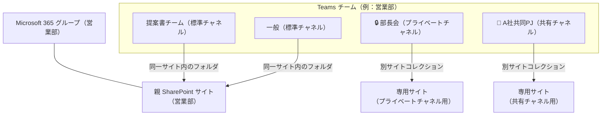
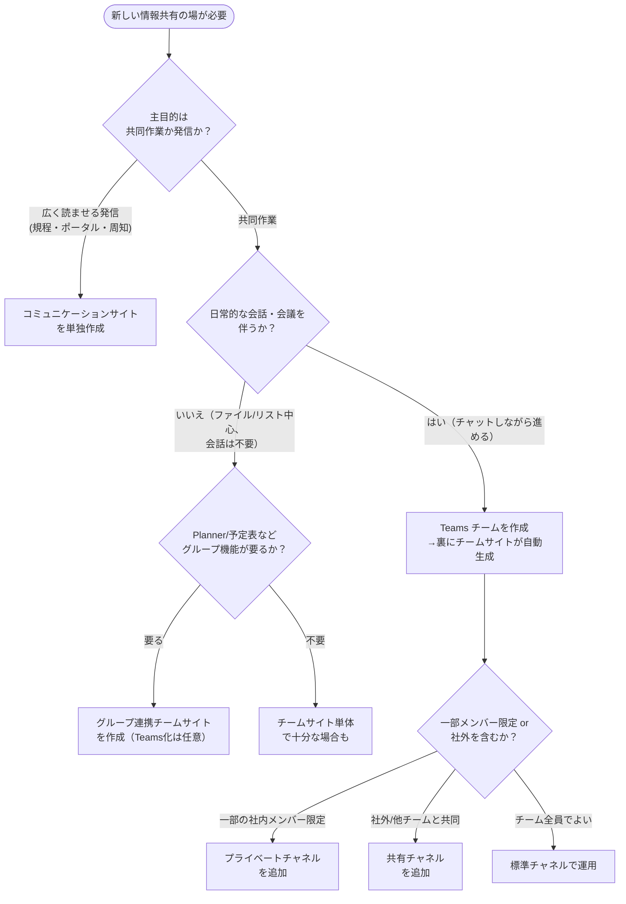

# 02. サイトの種類と Teams の使い分け

[← 目次に戻る](./README.md) ｜ [← 01. 全体アーキテクチャ](./01-architecture-and-workload-placement.md)

---

「SharePoint サイトを作る」と言っても、実は複数の種類があり、さらに **Teams チームを作ると裏で自動的に SharePoint サイトが生成**されます。この章では、サイトの種類を整理し、**「Teams チーム」と「純粋な SharePoint サイト」のどちらを選ぶべきか**の判断基準を提示します。ここが今回のご依頼の核心です。

## 1. モダン SharePoint サイトの種類

| 種類 | M365 グループ連携 | 主な用途 | 権限の既定 | 新規作成の推奨 |
| --- | --- | --- | --- | --- |
| **チームサイト（グループ連携）** | あり | チーム・部門の共同作業。Teams/Planner 等と連動 〔S6〕 | メンバー全員が編集可 〔S9〕 | ◎（共同作業の標準） |
| **コミュニケーションサイト** | なし | 全社・部門への“発信・閲覧”（ポータル、規程、周知） 〔S3〕 | 少数が編集、多数が閲覧 | ◎（発信の標準） |
| **ホームサイト／組織全体サイト** | なし（特別なコミュニケーションサイト） | 全社の玄関口（イントラのトップ）。公式ニュース源 〔S4〕 | 全社閲覧 | ○（全社に1つ） |
| チームサイト（グループなし） | なし | グループ連携が不要な共同作業（限定的） | サイト単位で管理 | △（原則グループ連携を推奨） |
| **クラシックサイト** | – | 旧来の UI・機能。新 InfoPath/2013 ワークフロー等 | – | ✕（新規作成しない。[第04章](./04-classic-migration-and-tools.md)） |

> 💡 **【補足】チームサイト＝“共同で作る”、コミュニケーションサイト＝“広く見せる”**
> ざっくり、**少人数で編集し合う**なら**チームサイト**、**多数に読ませる（編集者はごく少数）**なら**コミュニケーションサイト**です 〔S3〕。人事部が新制度を内々に検討するのはチームサイト、完成した制度を全社告知するのはコミュニケーションサイト、という使い分けが典型です。

> 💡 **【補足】ハブサイトはサイトの“種類”ではなく“束ね役”**
> ハブサイトは新しい種類のサイトではなく、既存のチーム/コミュニケーションサイトを**横串でつなぐ役割**を与えたものです。ナビゲーション共有・横断検索・デザイン統一に使います。詳細は [第03章](./03-information-architecture-and-permissions.md) の情報アーキテクチャで扱います 〔S5〕。

## 2. Teams チームと、その裏側の SharePoint サイト

Teams で**チームを作成するたびに、対応する SharePoint サイト（グループ連携チームサイト）が自動的に作られます**。チームでやり取りするファイルは、その SharePoint サイトのドキュメントライブラリに保存されます 〔S7〕。

### チャネルの種類と、裏の SharePoint 構造

| チャネル種類 | 見える範囲 | 裏の SharePoint | 主な用途 |
| --- | --- | --- | --- |
| **標準チャネル** | チームのメンバー全員 | **親サイト内のフォルダ**（同一ドキュメントライブラリ） 〔S8〕 | チームの通常の話題・作業 |
| **プライベートチャネル** 🔒 | チーム内の**指定メンバーのみ** | **専用の別 SharePoint サイト**（別サイトコレクション） 〔S8〕 | チーム内の一部だけで扱う機微な情報（例：管理職限定） |
| **共有チャネル** 🤝 | チーム内メンバー＋**招待した社外/他チーム**（チーム参加不要） | **専用の別 SharePoint サイト**（別サイトコレクション） 〔S8〕 | 社外パートナーや別部門との共同作業 |

> 💡 **【補足】なぜプライベート/共有チャネルは“別サイト”なのか**
> 標準チャネルは親サイトのフォルダを共有するため、**チームメンバーなら全員がファイルにアクセスできます**。しかし「一部メンバー限定」「社外を含む」となると、親サイトと権限を分ける必要があります。そのため Microsoft はこれらを**独立した別サイト（別サイトコレクション）**として作り、アクセスをチャネルのメンバーだけに限定します 〔S8〕。この仕組みを知らないと「プライベートチャネルのファイルはどこ？」で混乱します。

> ⚠️ **【注意】プライベートチャネルの作りすぎに注意**
> プライベートチャネルはチームごとに数の上限があり、増えるほど裏のサイトも増えて棚卸しが煩雑になります。「本当に限定が必要か」を都度判断し、多用しない設計が望ましいです（統制はフェーズ3で運用化）。

## 3. 判断フロー：Teams チーム vs 純粋な SharePoint サイト

新しい“場”を作るとき、次のフローで選びます。**原則は「会話を伴う共同作業なら Teams チーム、発信・閲覧中心なら純コミュニケーションサイト」**です。

### 判断の指針（言語化）

| 状況 | 推奨 | 理由 |
| --- | --- | --- |
| 部門・プロジェクトで会話しながら共同作業 | **Teams チーム**（→裏のチームサイトを活用） | 会話・会議・ファイルが1画面に集約され、現場の利用が定着しやすい 〔S7〕 |
| 全社・部門に“読ませる”ポータルや規程集 | **コミュニケーションサイト単独** | Teams は不要。編集少数・閲覧多数のモデルに最適 〔S3〕 |
| 会話は不要だが、リスト/ライブラリ/Planner を共有したい | **グループ連携チームサイト**（Teams 化は任意） | グループの共有設備は使いたいが会話は主目的でないケース 〔S6〕 |
| 既存チーム内の一部だけで機微情報を扱う | **プライベートチャネル** | 親サイトと権限分離された専用サイトが自動生成される 〔S8〕 |
| 社外パートナー／別部門と対等に共同作業 | **共有チャネル** | 相手はチームに参加せずに該当チャネルだけ参加できる 〔S8〕 |

> 💡 **【補足】「まず Teams チーム」で概ね正解、ただし乱立に注意**
> 現場の共同作業は「まず Teams チームを作る」で概ね正解です。ただし、**誰でも無制限に作れる状態はサイト乱立**を招きます。フェーズ1では「作成は情シス経由 or 申請制」といった**軽いブレーキ**を掛け、本格的な作成申請ワークフロー・棚卸はフェーズ3で運用化します（ガバナンスの考え方は 〔S16〕）。

## 4. よくある誤解の整理

| 誤解 | 正しい理解 |
| --- | --- |
| 「Teams のファイルは Teams の中に保存される」 | 実体は裏の **SharePoint サイト**にある 〔S7〕 |
| 「プライベートチャネルは親チームの中のフォルダ」 | **別サイト（別サイトコレクション）** 〔S8〕 |
| 「サイトはとりあえずチームサイトにしておけば良い」 | 発信用途は**コミュニケーションサイト**が適切 〔S3〕 |
| 「サブサイトを掘って整理する」 | モダンでは**サブサイトを作らずフラット＋ハブ**が推奨（[第03章](./03-information-architecture-and-permissions.md)） 〔S5〕 |

---

## この章のまとめ

- 新規は「**Teams チーム（＝グループ連携チームサイト）**」か「**コミュニケーションサイト**」の2択が基本。クラシック・サブサイトは作らない。
- Teams チームを作ると SharePoint サイトが自動生成され、ファイルはそこに入る。
- **標準チャネル＝親サイトのフォルダ**、**プライベート/共有チャネル＝別サイト**、という裏構造を理解する。
- 「共同作業＋会話→Teams」「発信・閲覧→コミュニケーションサイト」「一部限定→プライベートチャネル」「社外共同→共有チャネル」。

次章では、これらのサイトを**どう並べ（情報アーキテクチャ）**、**誰にどうアクセス権を与えるか（グループ・権限設計）**を扱います。

[→ 03. 情報アーキテクチャとグループ・権限設計](./03-information-architecture-and-permissions.md)
