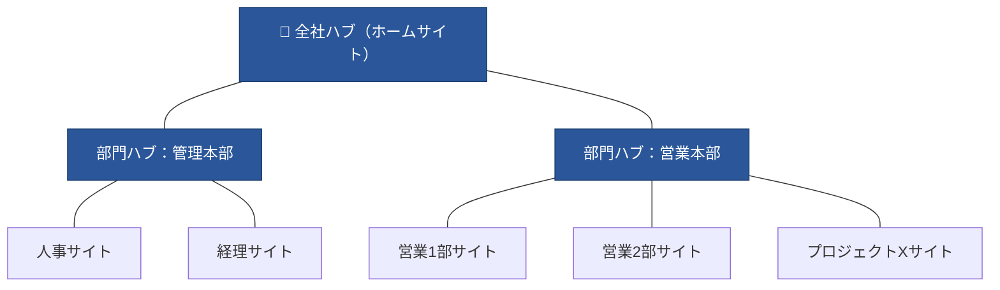
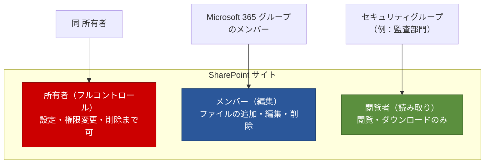

# 03. 情報アーキテクチャとグループ・権限設計

[← 目次に戻る](./README.md) ｜ [← 02. サイトの種類と Teams](./02-site-types-and-teams.md)

---

この章では、サイトを**どう並べるか（情報アーキテクチャ）**と、**誰にどうアクセス権を与えるか（グループ・権限設計）**を扱います。ファイルサーバーの「深いフォルダ＋個別 ACL」の発想から、モダンの「**フラット構造＋グループ単位の権限**」へ頭を切り替えることがポイントです。

## 1. 情報アーキテクチャ：サブサイトを作らず「フラット＋ハブ」

### 原則：サイトは平らに並べ、ハブで束ねる

ファイルサーバー時代は1つの共有の中にフォルダを深く掘って整理しました。モダン SharePoint では、これを**サイトを平らに並べ、ハブサイトで横串に束ねる**構造に置き換えます 〔S5〕。

> 💡 **【補足】なぜサブサイトを作らないのか**
> クラシック時代の「サブサイト」は、親サイトにぶら下げる入れ子構造でした。しかしこれは**組織変更に弱く**（部門統廃合でサイトの親子関係が破綻）、権限も複雑化します。そこで Microsoft は、サブサイトをやめて**各チームを独立したサイトとして平らに作り、ハブサイトで論理的にグループ化する**ことを推奨しています。ハブは付け替えが容易なので、組織変更にも柔軟に追随できます 〔S5〕。

### フォルダ vs メタデータ

| 従来（ファイルサーバー） | モダン（推奨） |
| --- | --- |
| 深いフォルダ階層で分類 | **浅いフォルダ＋メタデータ（列）**で分類 |
| 1つの分類軸しか持てない | 年度・種別・顧客など**複数軸で絞り込み・検索**できる |
| 移動すると場所が変わる | メタデータは場所を変えずに再分類できる |

最初から完璧なメタデータ設計は不要です。フェーズ1では「**むやみに深いフォルダを再現しない**」「**サイト＝アクセス範囲の単位**として切る」ことを徹底し、メタデータ活用は段階的に導入すれば十分です。

## 2. グループの種類と使い分け

権限設計の前提として、M365 の3種類の「グループ」を区別します 〔S10〕。

| 種類 | 主な目的 | 何が付いてくるか | 使いどころ |
| --- | --- | --- | --- |
| **Microsoft 365 グループ** | 共同作業 | SharePoint サイト・Teams・予定表・Planner 等が一式 〔S6〕〔S10〕 | チーム／部門の“場”の単位。Teams チーム作成で自動生成 |
| **セキュリティグループ** | リソースへのアクセス許可付与 〔S10〕 | 特に付随サービスなし。純粋な「人の束」 | 部署横断の権限付与、条件付きアクセスの対象指定など |
| **配布リスト（配布グループ）** | メールの一斉配信 〔S10〕 | メール配信のみ | 「全社員へ連絡」等のメール用途 |

> 💡 **【補足】どれを使う？の早見**
> - チームの“作業場所”が欲しい → **Microsoft 365 グループ**（≒ Teams チーム）
> - 「この人たちにこのサイトの閲覧権を」だけ与えたい → **セキュリティグループ**
> - メールを一斉送信したいだけ → **配布リスト**
>
> 迷ったら「**共同作業の場が要るか？**」で分けると整理できます。

## 3. 権限モデル：所有者／メンバー／閲覧者を「グループで」割り当てる

SharePoint サイトには既定で3つのロール（SharePoint グループ）があり、それぞれ権限レベルが割り当てられています 〔S9〕。

| ロール | 既定の権限レベル | できること | 誰を割り当てるか |
| --- | --- | --- | --- |
| **所有者** | フルコントロール | 設定変更・権限管理・サイト削除 | サイト管理者（**2名以上**推奨） |
| **メンバー** | 編集 | ファイル/リストの追加・編集・削除 | 日常的に作業する人 |
| **閲覧者** | 読み取り | 閲覧・ダウンロード | 見るだけの人・監査等 |

### 設計の3原則

1. **権限は“個人”ではなく“グループ”に付ける** 〔S9〕〔S10〕
   個人を直接サイトに追加すると、異動・退職のたびに棚卸しが破綻します。**Microsoft 365 グループ／セキュリティグループ単位**で付与し、人の出入りはグループのメンバー管理で吸収します。
2. **権限の境界は“サイト”で切る**
   「一部の人だけ見せたい情報」はフォルダの個別権限で作り込まず、**別サイト（またはプライベートチャネル）に分ける**のが原則です。アクセス範囲＝サイト、と単純化します。
3. **権限の継承を壊さない（固有の権限を乱発しない）** 〔S9〕
   SharePoint は既定で、サイト→ライブラリ→フォルダ→ファイルへ権限が**継承**されます。特定フォルダだけ継承を切って個別権限を付ける（＝固有の権限）と、権限が“見えない迷路”になります。**継承は極力維持**し、どうしても分けたいならサイトを分けます 〔S9〕。

> ⚠️ **【注意】アイテム/フォルダ単位の個別権限は“最後の手段”**
> ファイルサーバーの ACL 感覚で、フォルダごとに細かく権限を切りたくなりますが、モダンでは**アンチパターン**です。誰が何にアクセスできるか追跡不能になり、フェーズ2以降のセキュリティ統制も効きにくくなります。「分けたい＝サイトを分ける」を合言葉に。

> 💡 **【補足】コミュニケーションサイトなど「M365 グループを持たないサイト」の権限**
> 上図はチームサイト（M365 グループ連携）を例にしています。**コミュニケーションサイトやグループ非連携のチームサイトは、M365 グループを持たない**ため、メンバーは Teams のメンバー管理ではなく、**サイトの SharePoint グループ（所有者／メンバー／閲覧者）へ直接割り当て**ます 〔S9〕。この場合も原則は同じで、個人を直接足すのではなく **セキュリティグループを割り当てる**のが管理しやすくなります 〔S9〕〔S10〕。「全社閲覧」は “全社員” を含むグループを閲覧者に割り当てて実現します。

## 4. 共有リンクの基礎

モダンでは、フォルダ権限よりも**共有リンク**でアクセスを渡すのが日常運用です。リンクには主に次の種類があります。

| リンク種類 | 渡せる相手 | フェーズ1での既定推奨 |
| --- | --- | --- |
| 組織内のリンク | 社内の誰でも（リンクを知っていれば） | 用途に応じ可。既定リンクの種類はテナントで設定 |
| 特定のユーザー | 指定した人だけ | **最も安全。既定にするのが無難** |
| リンクを知っている全員（匿名） | 社外含む誰でも | フェーズ1では原則オフ（[第01章](./01-architecture-and-workload-placement.md)§5 〔S11〕） |

> 💡 **【補足】既定リンクを「特定のユーザー」に寄せる**
> テナント設定で、共有ボタンを押したときの**既定リンクを「特定のユーザー」**にしておくと、うっかり広く共有する事故を減らせます。フェーズ1で行う価値の高い初期設定の一つです。

## 5. フェーズ1の権限設計チェックリスト

- [ ] 各サイトの**所有者は2名以上**にした（退職・異動での孤児化を防ぐ）
- [ ] 権限は**個人直付けを避け、グループ**で割り当てた 〔S9〕
- [ ] 「一部限定」は**フォルダ個別権限ではなくサイト/プライベートチャネル分離**で実現した
- [ ] 原則として**権限の継承を維持**し、固有の権限は最小限にした 〔S9〕
- [ ] テナントの**既定共有リンクを「特定のユーザー」**に設定した
- [ ] 外部共有のテナント上限を絞り、必要なサイトだけ緩めた 〔S11〕
- [ ] 「サブサイトを作らない・深いフォルダを再現しない」を移行方針に明記した 〔S5〕

---

## この章のまとめ

- 情報アーキテクチャは**フラット＋ハブ**。サブサイトと深いフォルダは作らない。
- 分類はフォルダからメタデータへ、段階的に。
- 権限は **個人ではなくグループ**、**境界はサイト**、**継承は壊さない** の3原則。
- 「一部だけ見せたい」は権限の作り込みではなく**サイト/チャネルを分ける**で解く。

次章では、既存のクラシックサイトからモダンへ移行する際の注意点と、ファイルサーバー移行に使うツールの比較（メリデメ・費用）を扱います。

[→ 04. クラシック→モダン移行と移行ツール](./04-classic-migration-and-tools.md)
