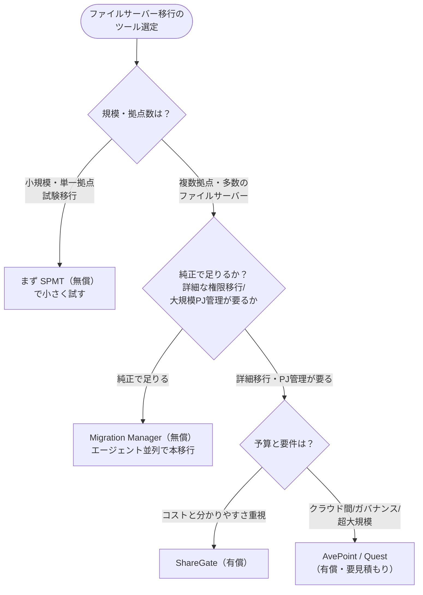

# 04. クラシック→モダン移行と移行ツール

[← 目次に戻る](./README.md) ｜ [← 03. 情報アーキテクチャと権限](./03-information-architecture-and-permissions.md)

---

この章は2部構成です。前半は、既存の **SharePoint Online クラシック形式サイト**からモダンへ切り替える際の注意点。後半は、**オンプレファイルサーバー／クラシックサイトから移行する際のツール**の比較（メリット・デメリット・費用）です。

---

# 第1部：クラシック→モダン移行の注意点

## 1. そもそもクラシックとモダンの違い

| 観点 | クラシック体験 | モダン体験 |
| --- | --- | --- |
| UI | 旧来のツールバー中心 | レスポンシブ、モバイル対応、Web パーツ |
| 連携 | 単体サイト中心 | M365 グループ・Teams・ハブと連動 |
| ページ | クラシックページ | モダンページ（セクション＋Web パーツ） |
| 拡張 | サーバーサイド/旧カスタマイズ | SPFx（SharePoint Framework） |

Microsoft はクラシックを即時「廃止」しているわけではありませんが、**モダン体験への移行・変換を一貫して推奨**しており、自動モダン化や PnP モダン化ツール等の手段を案内しています 〔S12〕。新規はモダンで作り、既存クラシックは計画的にモダン化する、が基本方針です。

> 💡 **【補足】「クラシックサイト」と「クラシックページ」は別**
> サイト全体がクラシックのテンプレートで作られている場合と、モダンサイト内に一部クラシックページが残っている場合があります。前者はサイトの作り直し（モダンなチーム/コミュニケーションサイトへ）を、後者はページ単位のモダン化を検討します 〔S12〕。

## 2. 移行前に必ず確認すべき「廃止・非推奨の機能」

クラシック環境には、**モダンでは動かない／近く廃止される機能**が含まれることがあります。これらを使っている場合、単純移行はできず**作り替え**が必要です 〔S13〕。

| 機能 | 状況 | 移行先 |
| --- | --- | --- |
| **SharePoint 2010 ワークフロー** | すでに廃止済み 〔S13〕 | **Power Automate** |
| **SharePoint 2013 ワークフロー** | 非推奨。**2026年4月2日以降、既存テナントで順次削除が進行中**（新規テナントでは既に無効） 〔S13〕 | **Power Automate** |
| **InfoPath フォーム** | **2026年7月14日でサポート終了済み** 〔S13〕 | **Power Apps／Forms／Lists フォーム** |
| クラシック Web パーツ／旧カスタマイズ（サーバーサイド等） | モダンで非対応のものが多い | **SPFx**、モダン Web パーツ、Power Platform |

> ⚠️ **【重要】ワークフロー・フォームの棚卸しを最優先で**
> 「ファイルを移せば終わり」と思っていると、**業務を回している 2013 ワークフローや InfoPath フォームが移行後に動かない**という事故が起きます。これらの廃止・サポート終了は **2026 年にすでに到来**しており（上表参照）、猶予がありません。**現行クラシック環境で何が動いているかの棚卸し**を移行計画の最初に行ってください 〔S13〕。

## 3. モダン化の進め方（選択肢）

| アプローチ | 向くケース | 概要 |
| --- | --- | --- |
| **作り直し（推奨・多くの場合）** | 構造を見直したい、クラシック依存が強い | モダンなチーム/コミュニケーションサイトを新設し、コンテンツを移す。[第02章](./02-site-types-and-teams.md) の設計を適用 |
| ページのモダン化 | サイトは活かしページだけ古い | クラシックページをモダンページへ変換（自動変換／PnP ツール） 〔S12〕 |
| 段階的併存 | 一度に切り替えられない | モダンを新設しつつクラシックを一定期間残す。ただし“恒久併存”は避ける |

移行を機に、旧来の深いフォルダ構造や独自権限をそのまま持ち込まず、[第01〜03章](./01-architecture-and-workload-placement.md) の**棲み分け・フラット構造・グループ権限**に再設計することを強く推奨します。

---

# 第2部：移行ツールの比較（メリット・デメリット・費用）

オンプレファイルサーバー／クラシックサイトから SharePoint Online・OneDrive・Teams へ移行するツールを整理します。

> ⚠️ **【費用に関する注意】**
> 有償ツールの費用は**変動が激しく、多くが「要見積もり／非公開」**です。以下の金額は調査時点の**参考値（変動あり）**であり、正式な金額は各ベンダー／国内代理店の見積もりによります。日本円建ての実勢価格は代理店経由で確認してください。

> 💡 **【補足】1ファイル 250GB 上限は「ツールの差」ではなく SharePoint 側の前提**
> SPMT・Migration Manager をはじめ各ツールで言及される「1 ファイル 250GB」の上限は、**SharePoint Online 側のプラットフォーム上限**であり、どのツールにも等しく適用されます。ツール選定の差別化要因ではないため、以下では各ツール固有の強み・弱みに絞って記載します。

## 1. 無償ツール（Microsoft 純正）

### ① SharePoint Migration Tool（SPMT）― 無償
- **対応ソース**：ファイル共有、SharePoint Server（2010〜2019）
- **メリット**：無料。M365 との親和性が高い。移行時に**モダン構造への切り替えを選択可**。メタデータ・バージョン履歴の移行に対応。CSV/JSON で一括タスク投入可 〔S14〕
- **デメリット**：**中央管理（一元ダッシュボード）を持たない**ため、複数マシンで走らせても協調・並列制御ができず、各ジョブを個別に監視する必要がある（大規模・多拠点では手間が増える）
- **費用**：**無償**
- **向くケース**：小〜中規模、単一拠点、まず試験移行したいとき

### ② Migration Manager（SharePoint 管理センター内）― 無償
- **対応ソース**：ファイル共有、オンプレ SharePoint、Box/Dropbox/Google Workspace 等のクラウド 〔S15〕
- **メリット**：複数マシンに軽量**エージェントを入れて並列・分散移行**が可能。管理センター内の**一元ダッシュボード**で全タスクを監視。**大規模・分散ファイルサーバーの移行は SPMT より Migration Manager が推奨** 〔S15〕
- **デメリット**：純正ゆえ、権限マッピング等の柔軟性はサードパーティに劣る面がある
- **費用**：**無償**
- **向くケース**：複数拠点・多数のファイルサーバーを持つ中堅企業の本移行

> 💡 **【補足】Mover は？**
> かつてのクラウド間移行ツール「Mover」は、管理者主導の移行機能が **Migration Manager に統合**され、単独提供は実質終了しています。新規に選定する対象からは外し、Migration Manager を検討してください。

## 2. 有償ツール（第三者製）

### ③ ShareGate（Migrate）― 有償
- **メリット**：高速移行、**権限（継承の破れ含む）とメタデータの精緻なマッピング**、事前移行レポート、直感的 UI、PowerShell 自動化に強い 〔V1〕
- **デメリット**：超大規模ではバッチ分割前提。高度設定に技術力が要る
- **費用（参考・変動あり）**：年額ライセンス。公式料金表で概ね **$5,995〜$17,995/年**（アクティベーションするマシン数で階層）。プロジェクト実費は規模により $15K〜$80K 規模との第三者推計もあり 〔V1〕
- **向くケース**：中堅企業で、分かりやすい UI と詳細な権限移行を両立したいとき

### ④ AvePoint（Fly / 移行製品）― 有償
- **メリット**：検出・スキャンは無償。権限・バージョン・秘密度ラベル等を保持する**高忠実度（Full Fidelity）マッピング**、TB 級の大容量対応、**ガバナンス機能**（権限リスクの検出・是正）が強い 〔V2〕
- **デメリット**：導入設定に工数と専門性。サポート品質にばらつきの指摘
- **費用（参考・変動あり）**：**非公開／要見積もり**（第三者推計でユーザー月額 $4〜$12 との情報はあるが要確認）〔V2〕
- **向くケース**：クラウド間・非 SharePoint ソースを含む複雑な統合、ガバナンス要件が強い大規模案件

### ⑤ Quest Metalogix Content Matrix ― 有償
- **メリット**：複雑・大規模移行に強い。**ゼロダウンタイム**移行、分散移行によるスケール、フル/差分・再移行、移行前後のコンテンツ再編成 〔V3〕
- **デメリット**：学習曲線が高く小規模には過剰。中小には高価。複雑構成では専門サービスが必要になりがち
- **費用**：**非公開／要見積もり**（規模・機能要件に応じた個別見積もり）〔V3〕
- **向くケース**：古い SharePoint バージョンを含む複雑・大規模移行

### （参考）その他
- **Cloudiway**：ワークロード別ライセンス。参考で約 €9.5〜17/ユーザー〜（変動あり）。インスタント見積もりあり
- **BitTitan MigrationWiz**：ユーザー買い切り課金との情報（$10〜25/ユーザー、一次情報未確認・参考）

## 3. 横断比較表

| ツール | 提供元 | 費用 | 対応ソース | 主な強み | 主な弱み |
| --- | --- | --- | --- | --- | --- |
| **SPMT** | Microsoft | **無償** | ファイル共有、SP Server 2010-2019 | 無料、モダン構造へ変換可 | 一元管理なし・個別監視、大規模/多拠点は手間 |
| **Migration Manager** | Microsoft | **無償** | ファイル共有、オンプレSP、各種クラウド | エージェント並列分散、一元管理、大規模向き | 権限マッピングの柔軟性は限定的 |
| **ShareGate** | Workleap | $5,995〜$17,995/年（参考・変動） | ファイル共有、SP、OneDrive、Teams | 高速、精緻な権限/メタデータ移行、UI良好 | 超大規模はバッチ分割前提、技術力要 |
| **AvePoint Fly** | AvePoint | 非公開/要見積もり | ファイル共有、多様クラウド、SP/OneDrive/Teams | 高忠実度、大容量、ガバナンス機能 | 導入が複雑、サポートにばらつき |
| **Quest Content Matrix** | Quest | 非公開/要見積もり | 旧SP含む、ファイル共有 | 複雑・大規模、ゼロダウンタイム、再移行 | 学習曲線高、中小には高価 |

## 4. 選定の考え方（100〜1,000名・国内中堅企業）

**基本方針**：
1. まず**無償の SPMT / Migration Manager で PoC（小規模試験移行）**を行う。多くの中堅企業は、追加コストなしの **Migration Manager（並列・一元管理）で本移行まで到達**できます。
2. 詳細な権限マッピング・大規模プロジェクト管理・移行後レポートまで求める場合に、**ShareGate**（UI とコストのバランス）を第一候補として検討。
3. クラウド間・非 SharePoint ソースの統合や強いガバナンス要件がある場合に **AvePoint / Quest** を評価。**必ず相見積もり＋無料トライアル/無料スキャン**で検証する。

> 💡 **【補足】移行は「棚卸し→クレンジング→PoC→本移行」の順で**
> ツール選定の前に、**移行対象の棚卸し（容量・世代数・最終更新日・不要データ）とクレンジング（不要ファイルの削除）**を行うと、移行時間もライセンス費用も圧縮できます。長年放置された「使われていない共有」をそのまま移すのは、コストと権限混乱の両面で損です。

---

## この章のまとめ

- クラシックは即廃止ではないが、Microsoft はモダン化を推奨。**移行を機にフラット構造・グループ権限へ再設計**する。
- **2013 ワークフロー（2026年4月以降、既存テナントで順次削除中）・InfoPath（2026年7月14日でサポート終了済み）**を最優先で棚卸しし、Power Automate / Power Apps へ作り替える 〔S13〕。
- 移行ツールは**無償の SPMT / Migration Manager が基本**。詳細移行や大規模なら ShareGate、複雑統合なら AvePoint / Quest。費用は要見積もり。
- 「棚卸し→クレンジング→PoC→本移行」の順で進める。

---

これでフェーズ1（基礎編）の本文は完了です。各説明の根拠は [出典一覧（Appendix）](./90-references.md) を、用語は [用語集](./99-glossary.md) を参照してください。フェーズ2（セキュリティ）以降は別途作成します。

[→ 90. 出典一覧](./90-references.md) ｜ [→ 99. 用語集](./99-glossary.md)
