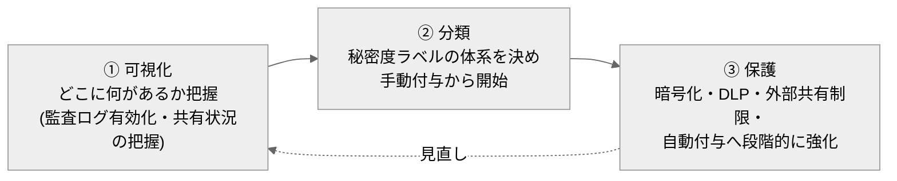
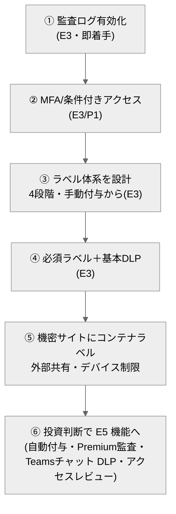

# 10. フェーズ2：セキュリティ（秘密度ラベル・監査・情報保護）

[← 目次に戻る](./README.md)

---

フェーズ1で「正しい土台（構成・棲み分け・権限）」ができたら、次はその上に**情報保護の網**をかけます。フェーズ2では、Office ファイルへの「社外秘／極秘」等の**秘密度ラベル**、情報漏えい防止（**DLP**）、監査向けの**ログ機能**の有効化を扱います。

> 📌 **本章のマークの意味（費用の目印）**
> - **✅ … いまの E3 契約のまま・追加費用なしでできる**
> - **💰 … 追加の課金・契約が必要**（カッコ内が必要なもの。E5＝上位プラン、Entra P2＝ID の上位機能、いずれも有料）

## この章でできるようになること（まずはざっくり）

むずかしく考えず、「何ができるか」を普段の言葉で。詳細は §1 以降で説明します。

- 🔍 **記録を残す**：誰がどのファイルを開いた・共有した・消したかを記録し、後から調べられる（＝監査ログ）… **✅ E3**
- 🏷️ **ファイルに「社外秘」の札を付けて守る**：Office ファイルにラベルを付け、暗号化する（＝秘密度ラベルを手で付ける）… **✅ E3**
- 🤖 **札を自動で付ける**：中身（マイナンバー等）を判定して自動でラベル … **💰 追加（E5）**
- 🚫 **持ち出しを止める**：クレカ番号入りファイルの外部共有をブロック（＝DLP）… **✅ E3**（ただし Teams チャット本文・PC の USB は **💰 E5**）
- 🔐 **入口を固める**：社外からは MFA 必須、私物 PC は閲覧のみ 等（＝条件付きアクセス）… **✅ E3**（高度なリスク自動判定は **💰 E5**）
- 🧹 **ゲストを棚卸す**：招いた社外ユーザーを定期的に見直す（＝アクセスレビュー）… **💰 追加（E5 相当）**

👉 **まず ✅（E3のまま）でできる「記録を残す・入口を固める・手で札を付ける」から着手**し、💰 の高度機能は投資判断とセットで後から足す――これがフェーズ2の基本方針です。

## 追加費用の要否ひとめ表

| やりたいこと（機能） | ざっくり何ができる | 追加費用は？ |
| --- | --- | --- |
| 監査ログ（Standard・180日） | 操作の記録を残し調査する | **✅ E3のまま** 〔S24〕 |
| 秘密度ラベル（手で付ける・暗号化） | ファイルに「社外秘」等を付けて守る | **✅ E3のまま** 〔S18〕 |
| DLP（SharePoint/OneDrive/Exchange のファイル） | 機微情報の外部共有をブロック | **✅ E3のまま** 〔S22〕 |
| 条件付きアクセス（基本）／MFA | 入口をMFA・デバイス条件で固める | **✅ E3のまま**（Entra P1 は E3 内包）〔S27〕 |
| 保持（手動・場所ベース） | 規程に沿って保持・自動削除 | **✅ E3のまま** 〔S25〕 |
| 秘密度ラベルの**自動**付与 | 中身を判定して自動で札を付ける | **💰 追加（E5／E3＋E5 Compliance）** 〔S19〕 |
| DLP（**Teams チャット本文**） | チャット内の機微情報を検知 | **💰 追加（E5）** 〔S22〕 |
| **エンドポイント DLP**（PC 操作） | USB コピー・印刷・アップロードを制限 | **💰 追加（E5 相当）** 〔S23〕 |
| 監査ログ **Premium**（1年保持等） | 長期保持・高付加価値イベント | **💰 追加（E5／E5 Compliance）** 〔S24〕 |
| 保持の**内容ベース自動適用** | 分類子・機微情報で自動ラベル | **💰 追加（E5）** 〔S25〕 |
| eDiscovery（Premium） | 訴訟・調査向けの高度な開示 | **💰 追加（E5 系）** 〔S25〕 |
| **リスクベース**条件付きアクセス | サインインリスクで動的制御 | **💰 追加（E5＝Entra P2）** 〔S27〕 |
| **アクセスレビュー**（ゲスト棚卸し） | ゲストを自動で定期見直し | **💰 追加（E5 相当＝Entra P2/Governance）** 〔S28〕 |

> 💰 **【要注意】E3 だけでは“できない”＝追加の契約・課金が必要なもの（フェーズ2）**
> 次は E3 に含まれず、**上位プラン等の追加購入が必要**です。導入を検討する際は、必ず**追加ライセンスの調達（費用・対象人数）とセット**で計画してください。
> - **秘密度ラベルの自動付与**（E5／E3＋E5 Compliance）
> - **Teams チャット本文の DLP／エンドポイント DLP**（E5）
> - **監査ログ Premium**（E5／E5 Compliance）
> - **保持の内容ベース自動適用・eDiscovery Premium**（E5 系）
> - **リスクベース条件付きアクセス／アクセスレビュー**（E5＝Entra ID P2）
>
> ⚠️ 上位機能は原則、**その機能の恩恵を受ける利用者側**に上位ライセンスが必要です（例：自動ラベル付けは対象文書を持つ利用者に E5 相当）。「管理者だけ E5」で済むとは限りません。**どの利用者に何が必要か**を機能ごとに一次情報で確認してから調達してください（過少ライセンスはコンプライアンス違反の恐れ）〔S19〕。ライセンス条件は改定されるため、契約前に「Microsoft Purview サービスの説明」等の一次情報で最終確認を。

## 1. 情報保護の全体像 ―「可視化 → 分類 → 保護」を段階的に

Microsoft の推奨は、いきなり厳しく縛るのではなく、**緩い制御から始めて反復的に精度を上げる**アプローチです 〔S29〕。

- **① 可視化**：まず監査ログを有効化し（後述§4）、現状「誰が何を外部共有しているか」を把握する。ここは**E3 で今すぐ着手可能**。
- **② 分類**：「社外秘」「極秘」などのラベル体系を決め、**手動付与**から始める（E3）。
- **③ 保護**：ラベルに暗号化・アクセス制御を紐づけ、DLP や自動付与（E5）へと段階的に強化する。

## 2. 秘密度ラベル（社外秘・極秘などのタグ付け）

**秘密度ラベル**は、ファイルやメールに「社外秘」「極秘」といった**分類**を付け、その分類に応じた**保護（暗号化・アクセス制御・透かし等）**を自動的に適用する仕組みです。ラベルはファイルに埋め込まれ、**ファイルが移動・コピーされても保護が維持**されます 〔S17〕。

> 💡 **【補足】「ラベル」と「権限」はどう違う？**
> フェーズ1の権限（サイト/ライブラリのアクセス権）は「**その置き場所に誰が入れるか**」を制御します。秘密度ラベルは「**そのファイル自体に**」保護を付けるため、**ファイルが持ち出されても効き続けます**。両者は補完関係で、土台の権限（フェーズ1）＋ファイルのラベル（フェーズ2）の二重で守ります。

### 2-1. ラベル体系の設計例（汎用）

まずシンプルな4段階程度から始めるのが定石です。

| ラベル | 想定 | 適用する保護の例 |
| --- | --- | --- |
| **公開** | 対外公開してよい情報 | 保護なし |
| **社内限り** | 社員なら閲覧可 | 外部共有を警告／制限 |
| **社外秘** | 部門・関係者限定 | 暗号化（社内ユーザーに限定）、外部共有ブロック |
| **極秘** | ごく一部の限定メンバー | 強い暗号化、透かし、コピー/印刷制限、ダウンロード制限 |

> 💡 **【補足】ラベルは「少なく・分かりやすく」から**
> 最初から10段階も作ると現場が選べません。**4段階前後・名称は直感的に**。運用に慣れてからサブラベル（例：極秘 > 取締役限定）を足します。ラベルの削除・格下げ時に**理由の入力を必須**にする設定も可能で、監査に有効です 〔S21〕。

### 2-2. 手動付与（E3で可能）と自動付与（E5）

| 方式 | 内容 | ライセンス |
| --- | --- | --- |
| **手動付与** | 利用者が Office アプリのリボンからラベルを選択。暗号化も適用可 | **E3 で可能** 〔S18〕 |
| **既定ラベル・必須ラベル** | 新規文書に既定ラベルを自動設定、未ラベル保存を禁止（必須化） | 対象ライセンス（概ね E3〜）〔S21〕 |
| **自動付与** | 内容（マイナンバー・クレカ番号等のパターン）を検知して自動でラベル | **E5 または E3＋E5 Compliance** 〔S19〕 |

**推奨の進め方**：まず E3 で**手動付与＋必須ラベル**を全社展開し、利用者に分類を習慣づける。誤分類・付け忘れが課題化したら、E5 の**自動付与**を追加投資として検討します。

### 2-3. コンテナラベル（サイト・Teams・グループ単位のラベル）

秘密度ラベルは個々のファイルだけでなく、**SharePoint サイト／Teams／M365 グループ全体**にも付けられます（コンテナラベル）。これにより次を一括制御できます 〔S20〕。

- サイト/チームの**プライバシー**（パブリック／プライベート）
- サイトの**外部共有**の可否
- **非管理デバイス**（会社管理外の PC・私物）からのアクセス制限（ブロック／ブラウザのみ許可）〔S20〕

> 💡 **【補足】フェーズ1の「サイトで権限境界を切る」がここで効く**
> フェーズ1で「機密度の高い情報は別サイトに分ける」設計にしておくと、**サイト単位でコンテナラベルを付けるだけ**で機密サイトをまとめて強く保護できます。土台設計がセキュリティ強化の効率を左右します。（コンテナラベルの詳細なライセンス要件は要確認 〔S20〕）

## 3. DLP（情報漏えい防止）

**DLP（Data Loss Prevention）**は、「マイナンバー」「クレジットカード番号」などの**機微情報を含むファイルの外部共有・送信を検知してブロック・警告**する仕組みです 〔S22〕。

| 対象 | ライセンス |
| --- | --- |
| SharePoint / OneDrive / Exchange 上のファイル（および Teams のファイル共有） | **E3 で可能** 〔S22〕 |
| **Teams のチャット/チャネル本文**メッセージ | **E5 が必要** 〔S22〕 |
| **エンドポイント DLP**（PC 上での USB へのコピー・印刷・アップロード制限） | **E5 相当** 〔S23〕 |

**推奨**：まず E3 の範囲で SharePoint/OneDrive/Exchange に対し、「クレジットカード番号を含むファイルの外部共有をブロック」等の基本ポリシーを有効化。エンドポイントや Teams チャット本文まで守るなら E5 を検討します。

## 4. 監査ログ（ログ機能の有効化）

監査（Audit）は、「**誰が・いつ・どのファイルを・どう操作したか**（閲覧・ダウンロード・共有・削除等）」を記録します。**フェーズ2で最初にやるべき、E3 で今すぐ着手できる施策**です。

| 種別 | 保持期間 | 主な用途 | ライセンス |
| --- | --- | --- | --- |
| **Audit (Standard)** | **180 日** 〔S24〕 | 一般的な操作ログの検索・調査 | **E3 で可能** 〔S24〕 |
| **Audit (Premium)** | **1 年**（アドオンで最大10年） | 高付加価値イベント（メール閲覧等）、大量アクセスの調査、Activity API 高帯域 | **E5／E5 Compliance** 〔S24〕 |

> 💡 **【補足】監査ログは「事が起きてから」では遅い**
> 監査ログは**有効化した時点以降**しか記録されません。インシデント発生後に「先月の操作を調べたい」と思っても、有効化していなければ記録がありません。**フェーズ2の最初に有効化**しておくことが重要です（既定で有効な場合も、保持期間と対象を確認）。

## 5. 保持と電子情報開示（eDiscovery）

- **保持ポリシー／保持ラベル**：「経理文書は7年保持」「退職者データは一定期間後に削除」等、法令・社内規程に沿った保持・削除を自動化。**手動適用・場所（サイト等）ベースの保持は E3 で可能**。ただし**内容ベースの自動適用**（トレーニング可能な分類子・機微情報での自動ラベル付け、アダプティブスコープ）は **E5 相当**が必要 〔S25〕。
- **eDiscovery（電子情報開示）**：訴訟・調査時に関連データを検索・保全・書き出し。Standard と Premium があり、**Premium は E5 系** 〔S25〕。

## 6. 外部共有の厳格化とデバイス制御

フェーズ1では「テナント上限を絞ってサイト単位で緩める」初期設定を行いました。フェーズ2ではこれを**運用レベルで厳格化**します 〔S26〕。

- 機密サイト（コンテナラベル付き）からの**外部共有をブロック**、または特定ドメインのみ許可。
- **非管理デバイスからのアクセス制限**：会社管理外の端末では「ダウンロード禁止・ブラウザ閲覧のみ」に制限（Entra 条件付きアクセス連携）〔S20〕〔S26〕。
- ゲストアクセスの**有効期限**と**定期棚卸し**（§7 アクセスレビュー）。

## 7. ID 保護：多要素認証・条件付きアクセス

情報保護は「入口（ID）」を固めて初めて機能します。

| 施策 | 内容 | ライセンス |
| --- | --- | --- |
| **セキュリティ既定値** | MFA を全社一括で強制する最小構成 | **無償・全 SKU** 〔S27〕 |
| **条件付きアクセス（基本）** | 「社外からは MFA 必須」「非管理デバイスは制限」等を条件で制御 | **Entra ID P1（E3 に内包）** 〔S27〕 |
| **リスクベース条件付きアクセス** | サインインリスク・ユーザーリスクに応じた動的制御 | **Entra ID P2（E5 に内包）** 〔S27〕 |
| **アクセスレビュー** | ゲスト・グループメンバーの定期棚卸し | **Entra ID Governance／P2** 〔S28〕 |

> 💡 **【補足】まず「セキュリティ既定値」か「条件付きアクセス（P1）」で MFA を**
> E3 には Entra ID P1 が含まれるため、**条件付きアクセスで柔軟な MFA・デバイス制御**が可能です（セキュリティ既定値と条件付きアクセスは併用不可のため、要件に応じて選択）〔S27〕。ゲスト棚卸しの自動化（アクセスレビュー）は P2＝E5 相当が必要な点に注意。

## 8. フェーズ2の進め方（推奨ステップ）

**①〜④は E3 の範囲で着手可能**です。まずここを固め、⑤⑥は要件と投資判断に応じて段階導入します。

---

## この章のまとめ

- フェーズ2は E3 単独では完結せず、多くが **E5／E5 Compliance／Entra P2** を要する。**まず E3 でできること（監査有効化・MFA/条件付きアクセス・手動ラベル・基本DLP）から着手**。
- 秘密度ラベルは「社外秘/極秘」を**ファイル自体に**付けて持ち出し後も保護する。**手動付与は E3、自動付与は E5**。
- **監査ログは最初に有効化**（記録は有効化以降のみ）。Standard は E3・180日、Premium は E5・1年。
- フェーズ1で「機密は別サイト」に分けておくと、コンテナラベルで効率的に強く守れる。

次章では、これらを**継続的に回すためのガバナンス・運用**（ライフサイクル・命名・棚卸し）を扱います。

[→ 20. フェーズ3：ガバナンス・運用](./20-phase3-governance.md)
