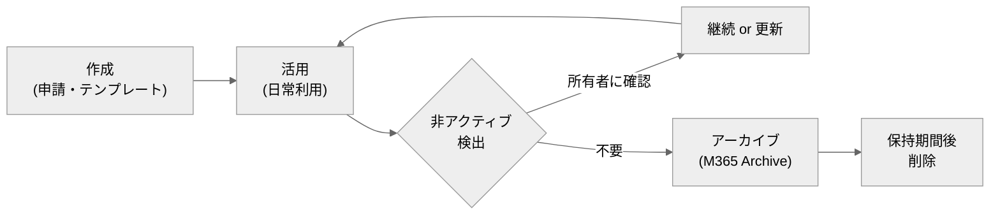

# 20. フェーズ3：ガバナンス・運用

[← 目次に戻る](./README.md)

---

フェーズ1で土台を作り、フェーズ2で情報保護をかけました。フェーズ3は、それらを**放置で崩さず回し続ける仕組み**を整えます。サイト／チームの**乱立・放置・所有者不在・過剰共有**を防ぎ、棚卸しと運用体制を確立します。

> 📌 **本章のマークの意味（費用の目印）**
> - **✅ … いまの E3 契約のまま・追加費用なしでできる**（※後述の Entra ID P1 の機能を含む。**P1 は E3 に内包されているので追加費用はかかりません**）
> - **💰 … 追加の課金・契約が必要**（カッコ内が必要なもの。**SAM**＝SharePoint Advanced Management という有償アドオン、**Entra P2**＝ID の上位機能で E5 相当、**M365 Archive**＝従量課金）

## この章でできるようになること（まずはざっくり）

- 🚦 **むやみに作らせない**：サイト/チームを作れる人を絞り、名前のルールも強制する（＝作成制限・命名規則）… **✅ E3のまま**
- ⏰ **使わないものを自動で片づける**：放置グループを自動失効させる … **✅ E3のまま**／放置サイトを検出して所有者に通知は **💰 追加（SAM）**
- 👤 **持ち主不在をなくす**：「所有者2名以上」を自動でチェック・強制 … **💰 追加（SAM）**
- 🔎 **見える化する**：どのサイトが使われ／使われていないかをレポートで把握 … **✅ E3のまま**
- 🧹 **ゲストを棚卸す**：招いた社外ユーザーを定期的に自動で見直す … **💰 追加（E5 相当＝Entra P2）**
- 🛡️ **開きすぎを直す**：過剰共有サイトを検出して是正する … **💰 追加（SAM）**
- 📦 **安く保管する**：使わないサイトを低コストの保管庫へ … **💰 追加（M365 Archive・従量課金）**

👉 **「作らせ方の統制（作成制限・命名・有効期限）」と「見える化」は ✅ E3のまま**着手できます（これらは Entra P1 の機能ですが P1 は E3 に含まれます）。**自動化（放置検出・所有権強制・過剰共有是正・ゲスト自動棚卸し）は 💰 追加**なので、規模とリスクを見て投資判断します。

## 追加費用の要否ひとめ表

| やりたいこと（機能） | ざっくり何ができる | 追加費用は？ |
| --- | --- | --- |
| サイト/グループ/Teams の作成・テンプレート | 申請に応じて正しい構成で払い出す | **✅ E3のまま** 〔S33〕 |
| 利用状況レポート | 使用/未使用サイトを把握する | **✅ E3のまま** 〔S41〕 |
| 作成できる人の制限 | 作れる人を情シス・部門長等に限定 | **✅ E3のまま**（Entra P1 は E3 内包）〔S30〕 |
| 命名規則（名前付けポリシー） | 名前ルール強制・禁止語ブロック | **✅ E3のまま**（Entra P1）〔S31〕 |
| グループ有効期限ポリシー | 未使用グループを自動失効 | **✅ E3のまま**（Entra P1）〔S32〕 |
| B2B ゲスト招待・基本のサイト所有者管理 | 社外を招く・所有者を設定 | **✅ E3のまま** 〔S42〕〔S38〕 |
| **アクセスレビュー** | ゲスト等を自動で定期棚卸し | **💰 追加（E5 相当＝Entra P2/Governance）** 〔S40〕 |
| **データアクセスガバナンスレポート** | 過剰共有を検出・可視化 | **💰 追加（SAM）** 〔S35〕 |
| **非アクティブサイトポリシー** | 放置サイトを自動検出・通知 | **💰 追加（SAM）** 〔S36〕 |
| **サイト所有権ポリシー** | 所有者要件を自動強制 | **💰 追加（SAM）** 〔S38〕 |
| **制限付きアクセス/コンテンツ検出（RCD）** | 対象サイトを検索/Copilot から除外 | **💰 追加（SAM）** 〔S37〕 |
| **Microsoft 365 Archive** | 使わないサイトを低コスト保管 | **💰 追加（従量課金）** 〔S39〕 |

> 💰 **【要注意】E3 だけでは“できない”＝追加の契約・課金が必要なもの（フェーズ3）**
> - **各種自動化ポリシー全般**（過剰共有の可視化・是正、放置サイト検出、所有権の自動強制、RCD）… **SharePoint Advanced Management（SAM）＝有償アドオン**〔S34〕
> - **ゲスト等の自動アクセスレビュー**… **E5 相当（Entra ID P2／Governance）**〔S40〕
> - **未使用サイトの低コスト保管**… **Microsoft 365 Archive＝従量課金の別サービス**〔S39〕
>
> 💡 なお **Microsoft 365 Copilot を契約している場合、SharePoint 管理者は SAM の一部機能に自動アクセス**できます（全社 SAM 契約とは別枠）〔S34〕。Copilot 導入（フェーズ4）とガバナンス強化は連動検討が効率的です。SAM の価格や条件は変動するため、代理店見積もり・一次情報でご確認ください。

## 1. 「作らせ方」を統制する（乱立の防止）

フェーズ1で「まず Teams チーム」を推奨しましたが、無制限だと**サイト乱立**を招きます。フェーズ3では作成を軽く統制します。

| 施策 | 内容 | ライセンス |
| --- | --- | --- |
| **作成できる人の制限** | グループ／Teams を作れるユーザーを、特定のセキュリティグループのメンバー（例：情シス・部門長）に限定 | **Entra ID P1** 〔S30〕 |
| **命名規則（名前付けポリシー）** | 接頭辞/接尾辞（例：`営業_〇〇`）を強制、禁止語（例：`社長`,`人事`,`Payroll`）をブロック | **Entra ID P1** 〔S31〕 |
| **申請・承認フロー** | セルフサービス作成を止め、Power Automate 等で申請→承認→自動プロビジョニング | E3 標準（自動化部分）〔S33〕 |

> 💡 **【補足】「作成禁止」より「正しく作れる導線」を**
> 作成を全面禁止にすると、現場は勝手な回避策（私物・野良ツール）に走ります。**申請すれば速やかに正しい構成のサイトが払い出される**導線（テンプレート＋承認）を用意するのが、統制と現場満足を両立するコツです 〔S33〕。

## 2. プロビジョニングの標準化

サイトを「作るたびにバラバラ」にしないため、**テンプレート化**します 〔S33〕。

- **サイトデザイン／サイトスクリプト**（標準機能）：作成時にライブラリ・列・権限・ナビ・ハブ参加などを自動適用。
- **PnP プロビジョニング**（コミュニティ製 OSS）：より高度なテンプレート適用。※Microsoft 公式サポート対象外である点に留意 〔S33〕。
- **Power Automate 連携**：申請フォーム → 承認 → サイト自動作成 → 命名・権限セットの自動付与。

## 3. ライフサイクル管理（棚卸し・所有者・アーカイブ）

「作ったら作りっぱなし」を防ぎ、**使われないサイトを検出・整理**します。

| 施策 | 内容 | ライセンス |
| --- | --- | --- |
| **グループ有効期限ポリシー** | 未使用グループを一定期間で自動失効（所有者に更新通知）。既定オフ | **Entra ID P1** 〔S32〕 |
| **非アクティブサイトポリシー** | 放置サイトを自動検出し所有者にメール通知、棚卸しを自動化 | **SAM** 〔S36〕 |
| **サイト所有権ポリシー** | 「所有者2名以上」等の要件を定義し、非準拠サイトへ自動通知・適用 | **SAM** 〔S38〕 |
| **Microsoft 365 Archive** | 非アクティブサイトを低コストのコールドストレージ層へ。検索・保護は維持 | 従量課金の別サービス 〔S39〕 |

> ⚠️ **【注意】最大のリスクは「所有者不在サイト」**
> 退職・異動で**所有者がいなくなったサイト**は、権限変更もできず放置され、ガバナンス上最も危険です。フェーズ1の「**所有者は2名以上**」ルールが効きますが、規模が大きい場合は SAM の**サイト所有権ポリシー**で自動検知・強制するのが確実です 〔S38〕。

## 4. 過剰共有（oversharing）の是正

「誰でもアクセスできる状態」を放置すると、フェーズ2の情報保護もフェーズ4の Copilot も台無しになります。

| 施策 | 内容 | ライセンス |
| --- | --- | --- |
| **データアクセスガバナンスレポート** | 過剰共有サイト・機密コンテンツを検出しレポート化 | **SAM** 〔S35〕 |
| **制限付きアクセス制御** | 指定グループのメンバーだけにサイトアクセスを限定（既存権限に優先） | **SAM**（一部）〔S37〕 |
| **制限付きコンテンツ検出（RCD）** | 対象サイトを組織横断検索・Copilot 結果から除外 | **SAM（有償）** 〔S37〕 |

> ⚠️ **【注意】名前が似た2機能を混同しない**
> ここで扱う **RCD（Restricted Content Discovery）は SAM の有償機能**です。一方、フェーズ4 で登場する **RSS（Restricted SharePoint Search）は全テナントで使える無償機能**で、別物です。日本語だと「制限付き検索」と一括りにされがちですが、**ライセンス帰属が真逆**（RCD＝有償／RSS＝無償）なので、原語で区別してください。

## 5. アクセスレビューとゲストの棚卸し

- **アクセスレビュー**：グループ・アプリ・**ゲスト**へのアクセスを定期的にレビューし、不要なアクセスを自動削除。**Entra ID P2／Entra ID Governance** が必要 〔S40〕。
- **ゲストのライフサイクル**：B2B 招待自体は E3 標準 〔S42〕。ただし**自動棚卸し・失効**は P2／Governance。フェーズ2の外部共有厳格化と合わせて、「招いたゲストを放置しない」運用を作ります。

## 6. 可視化（利用状況レポート）― E3で今すぐ

管理センターの**利用状況レポート**（SharePoint／OneDrive／Teams のアクティブ状況、ストレージ、コラボレーション）は **E3 標準**で使えます 〔S41〕。ガバナンスの出発点として、まず現状を数字で把握します。

> 💡 **【補足】E3 だけでも「見える化」はできる**
> SAM が無くても、標準の利用状況レポートで「どのサイトが使われ／使われていないか」の傾向は掴めます。まず E3 標準レポートで棚卸しを手動で回し、規模・工数が課題化したら SAM の自動化を検討する、という順が無理のない導入です。

## 7. 運用体制と役割分担

ツールだけでなく「誰が何に責任を持つか」を決めます 〔S43〕〔S16〕。

| 役割 | 主な責務 |
| --- | --- |
| **ガバナンス・コアチーム**（情シス＋業務部門代表） | プロビジョニング・命名・外部共有・保持等の全社方針を決定・維持 〔S43〕 |
| **SharePoint／M365 管理者** | テナント設定、テンプレート、レポート監視、ポリシー適用 |
| **サイト所有者**（現場） | 自サイトのメンバー・権限・コンテンツの管理、棚卸し対応（**2名以上**） |
| **一般利用者** | 棲み分け・ラベル・共有ルールの遵守 |

> 💡 **【補足】ガバナンス文書を1枚用意する**
> 「サイトはどう申請するか」「命名はどうするか」「外部共有はどこまで許されるか」「所有者の責務は何か」を**1枚のガイドライン**にまとめ、全社に周知します。これが運用の拠り所になります 〔S43〕。

## 8. フェーズ3の進め方（推奨ステップ）

1. **可視化**：E3 標準の利用状況レポートで現状把握（すぐ着手）〔S41〕。
2. **統制の初期設定**：Entra P1 で作成制限・命名規則・有効期限を設定（E3 内包）〔S30〕〔S31〕〔S32〕。
3. **プロビジョニング標準化**：テンプレート＋申請承認フローを整備 〔S33〕。
4. **体制・文書化**：ガバナンス・コアチームとガイドライン1枚を用意 〔S43〕。
5. **自動化（投資判断）**：規模・リスクに応じ、SAM（過剰共有是正・非アクティブ検出・所有権強制）と P2（アクセスレビュー）を導入 〔S35〕〔S36〕〔S38〕〔S40〕。

---

## この章のまとめ

- ガバナンスは「作らせ方（作成制限・命名・有効期限＝**Entra P1／E3内包**）」から始める。
- ライフサイクル（非アクティブ検出・所有権強制・過剰共有是正）の**自動化は SAM（有償）**、アクセスレビューは **Entra P2**。
- **可視化（利用状況レポート）は E3 標準**で今すぐ着手できる。まず手動で棚卸しを回し、工数が課題化したら自動化へ。
- 最大リスクは**所有者不在サイト**。「所有者2名以上」を徹底し、規模が大きければ SAM で強制。

次章では、これらの土台の上に載る**高度化・活用（Copilot／Power Platform）**を扱います（任意フェーズ）。

[→ 30. フェーズ4：高度化・活用（Copilot／Power Platform）](./30-phase4-advanced.md)
