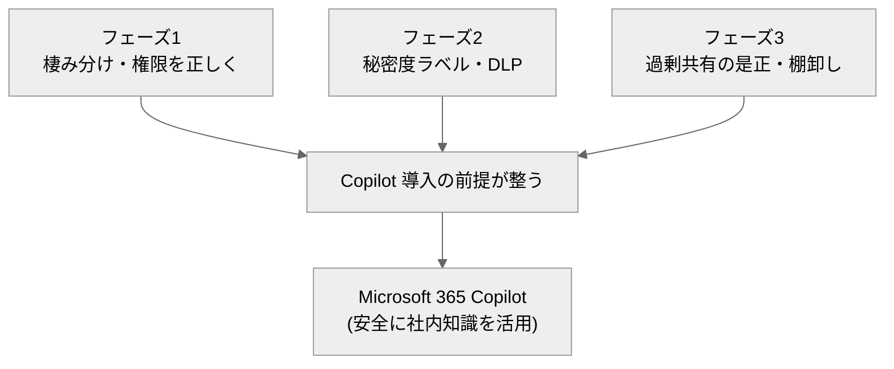

# 30. フェーズ4：高度化・活用（Copilot／Power Platform）

[← 目次に戻る](./README.md)

---

**任意フェーズ**です。フェーズ1〜3で「安全で整然とした基盤」ができたら、その上で **Microsoft 365 Copilot（AI 活用）** と **Power Platform（業務自動化）** で生産性を高めます。各社の戦略・投資判断によるため必須ではありません。

> 📌 **本章のマークの意味（費用の目印）**
> - **✅ … いまの E3 契約のまま・追加費用なしでできる**
> - **💰 … 追加の課金・契約が必要**（カッコ内が必要なもの）
>
> ⚠️ **この章の“主役”はほぼ 💰（追加課金）です。**Copilot、Power Automate/Apps の Premium、Power BI Pro は E3 に含まれません。ただし **Lists／Forms／Loop・標準コネクタの Power Automate は ✅ 付属**で、追加費用ゼロで今すぐ使えます。

## この章でできるようになること（まずはざっくり）

- 🔎 **社内の知識を AI に探させる・要約させる**：自分の権限で見られる資料を横断して回答（＝Copilot）… **💰 追加（Copilot サブスク）**
- ✍️ **申請・承認を自動化する**：フォーム入力 → 自動で上長へ承認依頼 → 台帳へ転記（＝Power Automate）… **✅ E3のまま**（標準コネクタ）／基幹システム連携は **💰 Premium**
- 📱 **かんたんな業務アプリ・入力画面を作る**：SharePoint リストからノーコードで（＝Power Apps、InfoPath の後継）… **✅ 一部 E3付属**／フル機能は **💰 Premium**
- 📊 **ダッシュボードで見える化する**：SharePoint のデータをグラフ化してページに埋め込み（＝Power BI）… **💰 追加（Power BI Pro 以上）**
- 🧩 **今すぐ使える道具で紙・Excel を置き換える**：Lists（簡易DB）・Forms（アンケート/申請）・Loop（共同編集）… **✅ E3のまま**

👉 **まず ✅ の付属機能（Lists／Forms／標準 Power Automate）で「紙・Excel 台帳・メール申請」を置き換えて成功体験を作り**、Copilot や Premium などの 💰 は費用対効果を見て段階導入する――これがフェーズ4の進め方です。

## 追加費用の要否ひとめ表

| やりたいこと（機能） | ざっくり何ができる | 追加費用は？ |
| --- | --- | --- |
| Lists / Forms / Loop | 簡易DB・アンケート・共同編集 | **✅ E3のまま** 〔S52〕 |
| Viva Connections（基本） | ポータルを従業員ダッシュボード化 | **✅ E3のまま**（一部拡張は要確認）〔S52〕 |
| Power Automate（標準コネクタ） | 承認・通知・転記の自動化 | **✅ E3のまま** 〔S48〕 |
| Power Apps（Basic） | SharePoint リスト連携アプリ | **✅ 一部 E3付属**（限定）〔S49〕 |
| Restricted SharePoint Search（RSS） | Copilot の参照範囲を一時的に限定 | **✅ E3のまま（無償・全テナント）** 〔S46〕 |
| **Microsoft 365 Copilot** | 社内知識を AI で検索・要約・生成 | **💰 追加（Copilot サブスク）** 〔S44〕 |
| Power Automate（プレミアムコネクタ・大規模） | 基幹系・外部SaaS連携、大量実行 | **💰 追加（Power Automate Premium）** 〔S48〕 |
| Power Apps（フル機能・無制限展開） | 本格的な業務アプリ展開 | **💰 追加（Power Apps Premium）** 〔S49〕 |
| Power BI（レポート作成・公開） | データをグラフ化・共有 | **💰 追加（Power BI Pro 以上）** 〔S50〕 |
| 過剰共有の恒久是正（RCD 等） | Copilot 前の是正を自動化 | **💰 追加（SAM）** 〔S46〕 |

> 💰 **【要注意】E3 だけでは“できない”＝追加の契約・課金が必要なもの（フェーズ4）**
> - **Microsoft 365 Copilot**（AI 活用の本体）… **Copilot 追加サブスクリプション**（E3 等の保有が前提）〔S44〕
> - **Power Automate / Power Apps の Premium**（基幹系連携・本格アプリ展開）… **各 Premium ライセンス**〔S48〕〔S49〕
> - **Power BI のレポート作成・公開**… **Power BI Pro 以上**（構成依存）〔S50〕
> - **Copilot 前の恒久的な過剰共有是正**… **SharePoint Advanced Management（SAM・有償）**〔S46〕
>
> 💡 逆に、**Lists／Forms／Loop・標準コネクタの Power Automate・Restricted SharePoint Search（RSS）は ✅ 追加費用ゼロ**。まずここから始めれば、コストをかけずに効果を出せます。

## 1. Microsoft 365 Copilot ―「導入前の地ならし」が9割

Copilot は、ユーザーが**自分の権限で見られる** SharePoint／OneDrive／Teams／Outlook のコンテンツを、Microsoft Graph 経由で参照して回答・要約・生成する AI アシスタントです 〔S44〕〔S45〕。

> ⚠️ **【最重要】Copilot は「過剰共有」をそのまま映す鏡**
> Copilot は**ユーザーがアクセスできる情報**を答えます。裏を返すと、**「誰でも見られる状態」で放置された機密情報は、Copilot が容易に引き出してしまいます**。つまり **oversharing（過剰共有）の是正（フェーズ3）と秘密度ラベル／DLP（フェーズ2）が Copilot の安全性を決めます** 〔S45〕。フェーズ1〜3を飛ばして Copilot だけ入れるのは危険です。

### Copilot 導入前のチェック（フェーズ1〜3の総仕上げ）

- 権限が**サイト単位で整理**され、個人直付け・過剰共有が是正されているか（フェーズ1・3）〔S45〕。
- 機密情報に**秘密度ラベル**が付き、暗号化文書は権限がないと参照されない状態か（フェーズ2）〔S45〕〔S47〕。
- 過渡期には **Restricted SharePoint Search**（許可リストで検索・Copilot 参照範囲を一時的に限定、最大100サイト）や、**SharePoint Advanced Management** のデータアクセスガバナンスで是正を進める 〔S46〕。

| 機能 | 役割 | ライセンス |
| --- | --- | --- |
| **Restricted SharePoint Search（RSS）** | 是正が済むまで Copilot・検索の参照範囲を許可リスト（最大100サイト）に限定する短期措置 | **M365 標準（無償・全テナント／SAM 不要）** 〔S46〕 |
| **SharePoint Advanced Management（SAM）** | 過剰共有の恒久的是正・データアクセスガバナンス（RCD 等） | **SAM（有償。一部は Copilot ライセンスに付帯）** 〔S46〕 |

> ⚠️ **【注意】RSS（無償）と RCD／SAM（有償）は別物**
> **Restricted SharePoint Search（RSS）は無償・全テナントで使える短期の“つなぎ”**、恒久的な過剰共有是正は **SharePoint Advanced Management（SAM・有償）** です。フェーズ3の RCD（Restricted Content Discovery）は SAM 側の機能です。名前が似ていますがライセンス帰属が異なります。

## 2. Power Automate（承認・通知の自動化）

**Power Automate** は、SharePoint リスト／ライブラリの更新をトリガーに、**承認・通知・転記**などを自動化します 〔S53〕。

- **標準コネクタ**（SharePoint、Teams、Outlook 等）のクラウドフローは **M365 に付属**（追加課金なし）〔S48〕。
- **プレミアムコネクタ**（基幹システム、SQL、外部 SaaS 等）や大規模・高頻度実行は **Power Automate Premium** が必要 〔S48〕。

典型例：ドキュメントライブラリに申請書がアップされたら、上長へ**承認依頼** → 承認されたら台帳リストへ**自動転記**し関係者へ**通知**。SharePoint 向けの承認テンプレートが多数用意されています 〔S53〕。

## 3. Power Apps（業務アプリ／InfoPath の後継）

**Power Apps** は、SharePoint リストをデータソースに**業務アプリ・入力フォーム**をノーコードで作成できます。フェーズ1で触れた **InfoPath の現代的な後継**です 〔S49〕。

- **Basic**：SharePoint リスト連携などに限定した範囲は一部 M365 ライセンスに付属 〔S49〕。
- **Premium**：フル機能・無制限のアプリ展開・プレミアムデータ接続には **Power Apps Premium**（追加課金）〔S49〕。

## 4. Power BI（レポート・可視化）

SharePoint リストをデータソースに **Power BI** でレポートを作成し、SharePoint ページに Web パーツとして**埋め込み**できます 〔S50〕。レポートの作成・公開には原則 **Power BI Pro 以上**が必要（Premium 容量構成では閲覧側が Free の場合もあり、テナント構成に依存）〔S50〕。

## 5. Power Platform のガバナンス

Power Automate／Power Apps を全社に広げると、**野良アプリ・野良フロー**が乱立し、データ持ち出し経路にもなり得ます。フェーズ3の考え方を Power Platform にも適用します 〔S51〕。

- **環境（Environment）の分離**：本番・開発・個人用を分ける。
- **Power Platform 用 DLP ポリシー**：業務データ系コネクタと SNS 等の外部コネクタを**同一フローで混在させない**よう制御。
- **Power Platform 管理センター**での一元管理。CoE（Center of Excellence）の考え方で運用（CoE Starter Kit は中核機能が管理センターへ統合が進行中）〔S51〕。

## 6. 付属機能で今すぐできる高度化（追加課金不要）

| 機能 | 用途 | ライセンス |
| --- | --- | --- |
| **Microsoft Lists** | 簡易 DB（案件管理・在庫・問い合わせ管理） | M365 付属 〔S52〕 |
| **Microsoft Forms** | アンケート・申請の入力受付 | M365 付属 〔S52〕 |
| **Loop コンポーネント** | Teams/Outlook/SharePoint 間でリアルタイム共同編集する部品 | M365 付属 〔S52〕 |
| **Viva Connections** | SharePoint ポータルを従業員向けダッシュボードに統合 | M365 付属（一部拡張は別ライセンスの可能性・要確認）〔S52〕 |

> 💡 **【補足】まず「付属機能」で成功体験を**
> Copilot や Premium に踏み込む前に、**Lists／Forms／標準 Power Automate**で「紙・Excel 台帳・メール申請」を置き換えると、追加費用ゼロで効果を出せます。ここで得た自動化の型が、後の Premium 投資の判断材料になります。

## 7. 業務自動化のユースケース例

| 業務 | 置き換え前 | 置き換え後（例） | 主に使う機能 |
| --- | --- | --- | --- |
| 稟議・申請承認 | 紙／メール回覧 | Forms 入力 → Power Automate 承認 → Lists 台帳 | Forms + Power Automate（標準）〔S53〕 |
| 文書の版・承認管理 | ファイルサーバーで手運用 | ライブラリのバージョン＋承認フロー | SharePoint + Power Automate 〔S53〕 |
| 社内ナレッジ検索 | 「どこにあるか分からない」 | Copilot／SharePoint 検索（権限・ラベル準拠）| Copilot（追加）〔S44〕 |
| 部門ダッシュボード | 個別 Excel | Lists ＋ Power BI をポータルに埋め込み | Lists + Power BI 〔S50〕 |

---

## この章のまとめ

- フェーズ4は**任意・追加投資**。主役（Copilot／Premium）は E3 に含まれない。
- **Copilot は過剰共有をそのまま映す**。フェーズ1〜3（権限整理・ラベル・過剰共有是正）が導入前提であり、地ならしが成否を決める 〔S45〕。
- **付属機能（Lists／Forms／Loop／標準 Power Automate）は追加課金ゼロ**で今すぐ高度化できる。まずここから成功体験を作る。
- Power Platform を広げるときは**環境分離・DLP ポリシー**でガバナンス（フェーズ3の考え方）を適用する。

---

以上でフェーズ1〜4の資料一式は完了です。全体の根拠は [出典一覧](./90-references.md)、用語は [用語集](./99-glossary.md) を参照してください。

[← 目次に戻る](./README.md)
