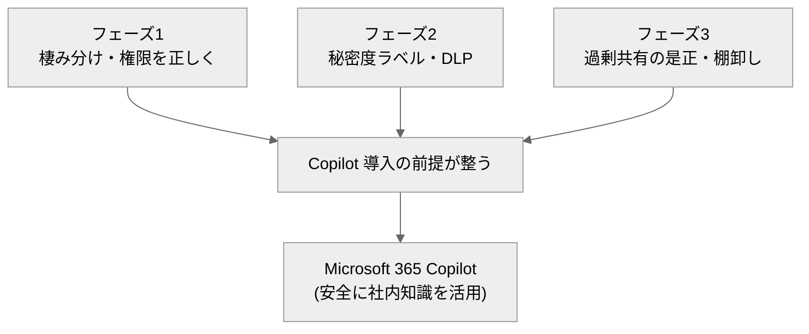

# 30. フェーズ4：高度化・活用（Copilot／Power Platform）

[← 目次に戻る](./README.md)

---

**任意フェーズ**です。フェーズ1〜3で「安全で整然とした基盤」ができたら、その上で **Microsoft 365 Copilot（AI 活用）** と **Power Platform（業務自動化）** により生産性を高めます。ここは各社の戦略・投資判断によるため、必須ではありません。

> ⚠️ **【ライセンス前提】この章の主役はほぼ「追加課金」**
> Copilot、Power Automate/Power Apps の Premium、Power BI Pro などは **E3 に含まれない追加ライセンス**です。「無償で使える」と誤解しないよう、各項目に必要ライセンスを明記します。一方、Lists／Forms／Loop や標準コネクタの Power Automate など **M365 に付属**して今すぐ使えるものもあります。

## 0. ライセンス早見表（フェーズ4）

| 機能 | M365（E3）に付属 | 追加ライセンスが必要 |
| --- | --- | --- |
| Microsoft Lists / Forms / Loop コンポーネント | ○ 〔S52〕 | — |
| Viva Connections ダッシュボード（基本） | ○（要確認）〔S52〕 | 一部 Viva 拡張は別ライセンスの可能性 |
| Power Automate（**標準コネクタ**のクラウドフロー） | ○ 〔S48〕 | — |
| Power Automate（**プレミアムコネクタ**・大規模） | ✕ | **Power Automate Premium** 〔S48〕 |
| Power Apps（Basic：SharePoint リスト連携アプリ） | ○（限定）〔S49〕 | — |
| Power Apps（フル機能・無制限展開） | ✕ | **Power Apps Premium** 〔S49〕 |
| Power BI（レポート作成・公開） | 原則 ✕ | **Power BI Pro 以上**（構成依存）〔S50〕 |
| **Microsoft 365 Copilot** | ✕ | **Copilot 追加サブスクリプション**（E3 等の基本ライセンス保有が前提）〔S44〕 |
| Power Platform ガバナンス（環境・DLP・管理センター） | ○（管理者権限で利用）〔S51〕 | 一部監査は E5／Purview |

## 1. Microsoft 365 Copilot ―「導入前の地ならし」が9割

Copilot は、ユーザーが**自分の権限で見られる** SharePoint／OneDrive／Teams／Outlook のコンテンツを、Microsoft Graph 経由で参照して回答・要約・生成する AI アシスタントです 〔S44〕〔S47〕。

> ⚠️ **【最重要】Copilot は「過剰共有」をそのまま映す鏡**
> Copilot は**ユーザーがアクセスできる情報**を答えます。裏を返すと、**「誰でも見られる状態」で放置された機密情報は、Copilot が容易に引き出してしまいます**。つまり **oversharing（過剰共有）の是正（フェーズ3）と秘密度ラベル／DLP（フェーズ2）が Copilot の安全性を決めます** 〔S45〕。フェーズ1〜3を飛ばして Copilot だけ入れるのは危険です。

### Copilot 導入前のチェック（フェーズ1〜3の総仕上げ）

- 権限が**サイト単位で整理**され、個人直付け・過剰共有が是正されているか（フェーズ1・3）〔S45〕。
- 機密情報に**秘密度ラベル**が付き、暗号化文書は権限がないと参照されない状態か（フェーズ2）〔S47〕。
- 過渡期には **Restricted SharePoint Search**（許可リストで検索・Copilot 参照範囲を一時的に限定、最大100サイト）や、**SharePoint Advanced Management** のデータアクセスガバナンスで是正を進める 〔S46〕。

| 機能 | 役割 | ライセンス |
| --- | --- | --- |
| Restricted SharePoint Search | 是正が済むまで Copilot の参照範囲を許可リストに限定（短期措置）| Copilot 関連／SAM 〔S46〕 |
| SharePoint Advanced Management | 過剰共有の恒久的是正・データアクセスガバナンス | SAM（一部は Copilot ライセンスに付帯）〔S46〕 |

## 2. Power Automate（承認・通知の自動化）

**Power Automate** は、SharePoint リスト／ライブラリの更新をトリガーに、**承認・通知・転記**などを自動化します 〔S53〕。

- **標準コネクタ**（SharePoint、Teams、Outlook 等）のクラウドフローは **M365 に付属**（追加課金なし）〔S48〕。
- **プレミアムコネクタ**（基幹システム、SQL、外部 SaaS 等）や大規模・高頻度実行は **Power Automate Premium** が必要 〔S48〕。

典型例：ドキュメントライブラリに申請書がアップされたら、上長へ**承認依頼** → 承認されたら台帳リストへ**自動転記**し関係者へ**通知**。SharePoint 向けの承認テンプレートが多数用意されています 〔S53〕。

## 3. Power Apps（業務アプリ／InfoPath の後継）

**Power Apps** は、SharePoint リストをデータソースに**業務アプリ・入力フォーム**をノーコードで作成できます。フェーズ1で触れた **InfoPath の現代的な後継**です 〔S49〕。

- **Basic**：SharePoint リスト連携などに限定した範囲は一部 M365 ライセンスに付属 〔S49〕。
- **Premium**：フル機能・無制限のアプリ展開・プレミアムデータ接続には **Power Apps Premium**（追加課金）〔S49〕。

## 4. Power BI（レポート・可視化）

SharePoint リストをデータソースに **Power BI** でレポートを作成し、SharePoint ページに Web パーツとして**埋め込み**できます 〔S50〕。レポートの作成・公開には原則 **Power BI Pro 以上**が必要（Premium 容量構成では閲覧側が Free の場合もあり、テナント構成に依存）〔S50〕。

## 5. Power Platform のガバナンス

Power Automate／Power Apps を全社に広げると、**野良アプリ・野良フロー**が乱立し、データ持ち出し経路にもなり得ます。フェーズ3の考え方を Power Platform にも適用します 〔S51〕。

- **環境（Environment）の分離**：本番・開発・個人用を分ける。
- **Power Platform 用 DLP ポリシー**：業務データ系コネクタと SNS 等の外部コネクタを**同一フローで混在させない**よう制御。
- **Power Platform 管理センター**での一元管理。CoE（Center of Excellence）の考え方で運用（CoE Starter Kit は中核機能が管理センターへ統合が進行中）〔S51〕。

## 6. 付属機能で今すぐできる高度化（追加課金不要）

| 機能 | 用途 | ライセンス |
| --- | --- | --- |
| **Microsoft Lists** | 簡易 DB（案件管理・在庫・問い合わせ管理） | M365 付属 〔S52〕 |
| **Microsoft Forms** | アンケート・申請の入力受付 | M365 付属 〔S52〕 |
| **Loop コンポーネント** | Teams/Outlook/SharePoint 間でリアルタイム共同編集する部品 | M365 付属 〔S52〕 |
| **Viva Connections** | SharePoint ポータルを従業員向けダッシュボードに統合 | M365 付属（一部拡張は別ライセンスの可能性・要確認）〔S52〕 |

> 💡 **【補足】まず「付属機能」で成功体験を**
> Copilot や Premium に踏み込む前に、**Lists／Forms／標準 Power Automate**で「紙・Excel 台帳・メール申請」を置き換えると、追加費用ゼロで効果を出せます。ここで得た自動化の型が、後の Premium 投資の判断材料になります。

## 7. 業務自動化のユースケース例

| 業務 | 置き換え前 | 置き換え後（例） | 主に使う機能 |
| --- | --- | --- | --- |
| 稟議・申請承認 | 紙／メール回覧 | Forms 入力 → Power Automate 承認 → Lists 台帳 | Forms + Power Automate（標準）〔S53〕 |
| 文書の版・承認管理 | ファイルサーバーで手運用 | ライブラリのバージョン＋承認フロー | SharePoint + Power Automate 〔S53〕 |
| 社内ナレッジ検索 | 「どこにあるか分からない」 | Copilot／SharePoint 検索（権限・ラベル準拠）| Copilot（追加）〔S44〕 |
| 部門ダッシュボード | 個別 Excel | Lists ＋ Power BI をポータルに埋め込み | Lists + Power BI 〔S50〕 |

---

## この章のまとめ

- フェーズ4は**任意・追加投資**。主役（Copilot／Premium）は E3 に含まれない。
- **Copilot は過剰共有をそのまま映す**。フェーズ1〜3（権限整理・ラベル・過剰共有是正）が導入前提であり、地ならしが成否を決める 〔S45〕。
- **付属機能（Lists／Forms／Loop／標準 Power Automate）は追加課金ゼロ**で今すぐ高度化できる。まずここから成功体験を作る。
- Power Platform を広げるときは**環境分離・DLP ポリシー**でガバナンス（フェーズ3の考え方）を適用する。

---

以上でフェーズ1〜4の資料一式は完了です。全体の根拠は [出典一覧](./90-references.md)、用語は [用語集](./99-glossary.md) を参照してください。

[← 目次に戻る](./README.md)
